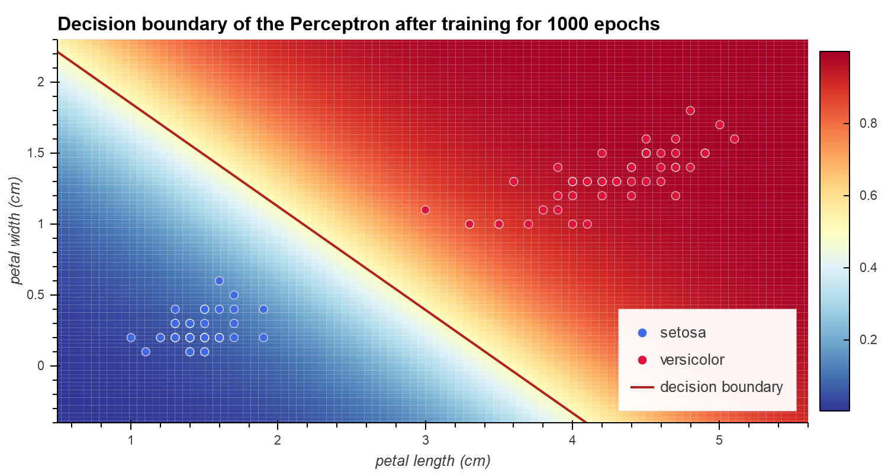
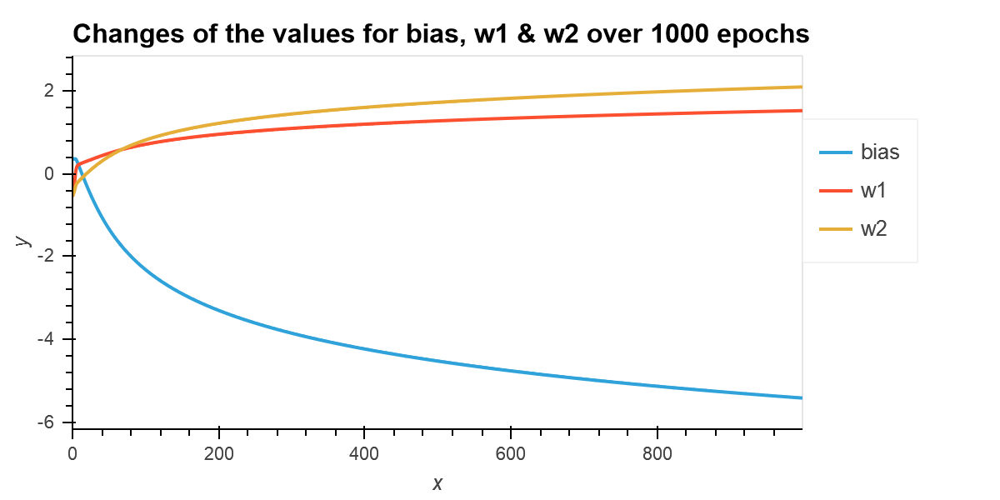
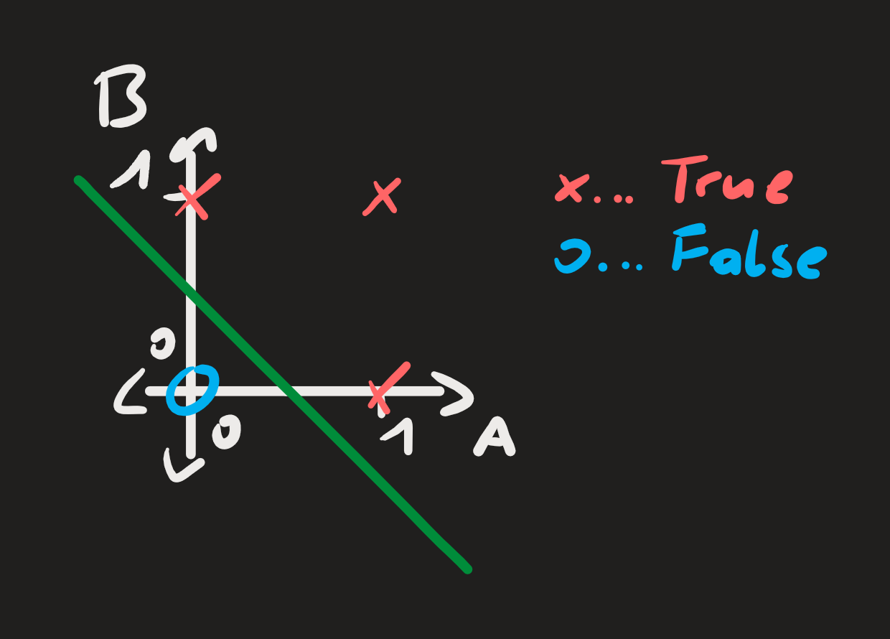
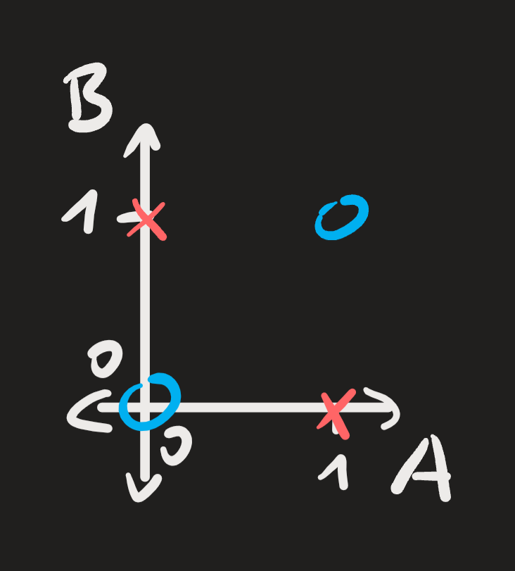

# neural-nets-basics
A collection of neural network scripts I've written, some from scratch

## `iris_perceptron.ipynb`

This Perceptron (single neuron ML alrogirthm) is one the first ML algorthms I coded from scratch. I chose this style of algorithm because I needed to know the basics to Neural Networks to build and debug it (boy was that fun), without the more complicated task of scaling that up to an entire network (yet). For training data, I chose the infamous iris dataset.

Since this is a Perceptron algorithm, all it can do is binary classification. However in the coming week I want to try and set up three Perceptrons, each specialized to classify one of the three iris species to create a multiclass classification algorithm (basically a single layer).

In the following image, you can see the prediction boundary after 1000 epochs of training:

And here the values for the weights over the epochs:

### Todo:
* Multiclass Classfication (all three iris species)
* simple regularisation

## `truth_table_perceptron.ipynb`

This is my first try at a perceptron. It's able properly classify 'linear' logical operators (AND, OR, NAND, NOR), but stuggles with 'nonlinear' ones (e.g. XOR). To explain what I mean with that here are two examples:

The first one is an OR gate with two inputs, A and B. The feature combinations \[A, B] = [1, 0], [0, 1], [1, 1] belong to the class 1 (or True), while \[0, 0] belongs to the class 0 (False). In this case, the perceptron is able to lay a single, straight line in between the classes and thereby classify correctly.

By contrast, here is the class 'distribution' for an XOR gate:

Since there is no way to split the classes with a single, straight line the perceptron reaches the limits of its classification abilities and is bound to misclassify some features.
